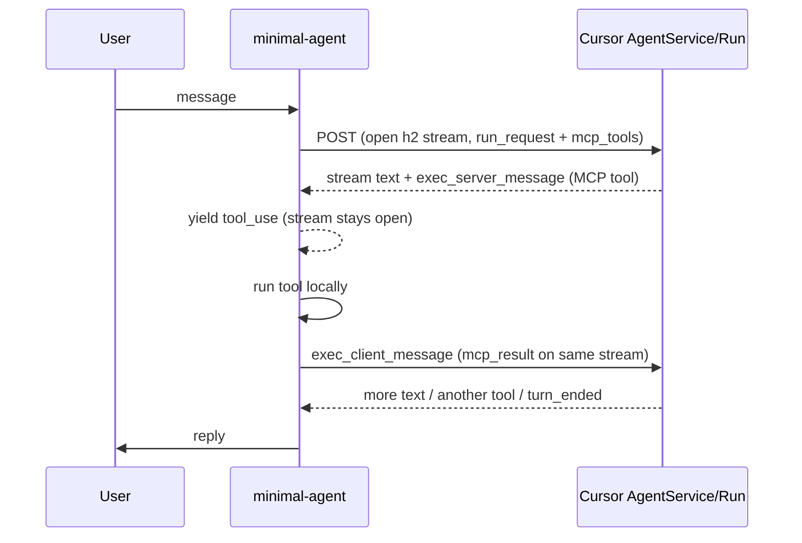
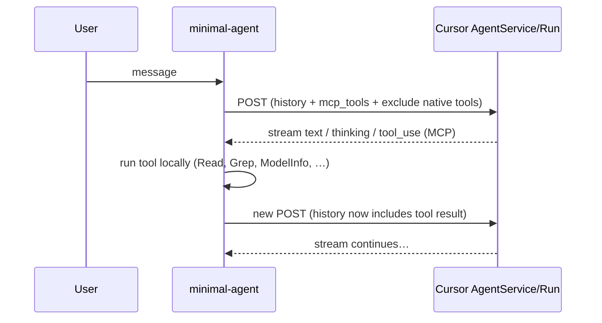

# ma-llm-cursor-plugin

Cursor **AgentService/Run** provider for [minimal-agent](https://github.com/gastonmorixe/minimal-agent-core).

This plugin speaks Connect RPC + protobuf (`application/connect+proto`) to
`agentn.api5.cursor.sh` for `agent.v1.AgentService/Run`, with AiService unary RPCs
on `api2.cursor.sh`. That is the **plugin** wire path (spike-proven), not a claim
that every Cursor Agent CLI build uses the same primary loop.

MA tools are **not** sent as Cursor built-ins (`grepToolCall`, `shellToolCall`, …). They ride the
**MCP** path (`mcp_tools` on the request, `mcp_tool_call` on the response).

## Quick start

```bash
# OAuth (browser login) or API key — stored in ~/.minimal-agent/auth.jsonc
minimal-agent provider cursor login

ma --provider cursor --model cursor-auto
```

`cursor-auto` maps to wire model id `default` (Cursor's Auto picker rejects bare `auto` on Run).

## How Cursor tools work in MA

### The problem

Cursor's agent API has a fixed set of **built-in** tools (grep, read, shell, web search, …).
You cannot register arbitrary tools (e.g. `Speak`, `ModelInfo`, `Task`) as new built-in oneofs.

The supported extension point is **MCP**:

1. Client sends tool **definitions** in `AgentRunRequest.mcp_tools`.
2. Model invokes them via `ToolCall.mcp_tool_call` (not `grep_tool_call`, etc.).
3. Client sends **exclude** headers so native tools do not compete with MA's.

This plugin does exactly that: MA's tool list → MCP wire shape, native oneofs excluded.

### Per-turn flow (with bidi — default when tools are enabled)



When the session has tools enabled (and `MA_CURSOR_BIDI` is not `0`):

1. **One HTTP/2 stream** stays open for the whole user turn (until `turn_ended` or abort).
2. Cursor sends `exec_server_message` with `mcp_args` when it wants a tool run.
3. MA yields `tool_use`, executes the tool, then on the **next** `run()` call writes
   `exec_client_message` with `mcp_result` on the **same** stream (session stored by `sessionId`).
4. Cursor continues on that stream — no second POST with folded history for tool rounds.

Text-only / `toolChoice: none` sessions still use the unary NetworkClient path (one POST, no bidi).

### Per-turn flow (unary fallback — no tools)



In plain terms:

1. **One HTTP request per agent loop step** — MA opens a stream, reads the model output, then closes it.
2. If the model asks for a tool, we translate that to MA's normal `tool_use` events and end the stream with `stopReason: tool_use`.
3. **MA executes the tool** (same as Anthropic/OpenAI) — not Cursor's built-in grep/shell.
4. On the **next** step, MA sends a **new** request with updated conversation (user + assistant + tool result).

So tool execution is owned by the harness. Cursor is the model backend; MA is the tool runtime.

### Bidi tool-result write (implemented)

**Bidi** = bi-directional: one connection stays open and both sides keep sending.

|              | Cursor IDE                       | minimal-agent (tools enabled)                 |
| ------------ | -------------------------------- | --------------------------------------------- |
| Connection   | Long-lived h2 stream             | Same — `connect/bidi-stream.ts`               |
| Tool request | `exec_server_message.mcp_args`   | Decoded → canonical `tool_use`                |
| Tool result  | `exec_client_message.mcp_result` | Written on same stream after MA runs the tool |
| Disable      | —                                | `MA_CURSOR_BIDI=0` forces unary fallback      |

Disable bidi with `MA_CURSOR_BIDI=0` to revert to one POST per agent loop step (history folded into each request).

### Wire details (for debugging)

| Piece                | Where                                                                                      |
| -------------------- | ------------------------------------------------------------------------------------------ |
| MCP tool definitions | `AgentRunRequest.mcp_tools` (protobuf field 4)                                             |
| Provider id on wire  | `minimal-agent` (`cursor-tool-policy.ts`)                                                  |
| Exclude native tools | Header `x-cursor-agent-exclude-tools` (all oneofs except `mcpToolCall` when tools enabled) |
| Tool call decode     | `proto/tool-call-decode.ts` → canonical `tool_use_*`                                       |
| Built-in catalog     | `cursor-builtin-tools.ts` (from Cursor bundle 2026.07.23)                                  |

`MINIMAL_AGENT_NET_DBG=1` writes binary-safe captures under `~/.minimal-agent/net-dbg/`.

### Conversation identity (plugin vs CLI)

| Field | Plugin behavior |
| ----- | --------------- |
| `conversation_id` (#5) | Host `metadata.sessionId` (or bidi session key). Fresh UUID only when neither is set. |
| `conversation_group_id` (#16) | Optional via `metadata.custom["cursor-conversation-group-id"]`. |
| `conversation_state` (#1) | **Empty** on each initial Run. This is a fresh/plugin MVP, not Cursor CLI resume. |

The official CLI resume path reconstructs typed `ConversationState` from a persisted blob graph (`ConversationStateStructure` + turn blobs). This plugin does **not** claim that semantics yet. Bidi tool rounds continue on the open stream without re-POSTing folded history.

## Architecture — bidi tool execution in detail

This section documents the internal architecture of the bidi tool loop, including
the protobuf decode/encode pipeline, session management, and the canonical event
bridge to the host adapter.

### Protobuf decode pipeline

```
HTTP/2 frame (Connect envelope)
  → decodeAgentServerMessage(payload)          # proto/exec-server-decode.ts
    ├─ field 1 (interaction_update)            # text, thinking, tool_call_started/completed
    │   → handleServerPayload()                # response-stream-bidi.ts
    │     → extractServerTextEvents()          # proto/agent-run.ts
    │
    └─ field 2 (exec_server_message)           # authoritative tool execution request
        → decodeExecServerMessageBody(body)    # proto/exec-server-decode.ts
          ├─ field 11 (mcp_args)               # our MCP tools
          │   → decodeMcpArgsBody(inner)       # map<string, Value> → input object
          │
          └─ field 2,5,7,8,14,… (native execs) # shell/grep/read/ls/etc. (fallback)
              → decodeNativeExecInput()        # maps to closest MA tool
```

The `ExecServerMessage` uses a **oneof** for the tool type. Despite the exclude
header, the server sometimes sends native execs (e.g. `shell_stream_args` field 14)
alongside or instead of MCP. The decoder handles both: MCP takes priority, native
execs fall back to the closest MA tool name.

### Protobuf map decode (McpArgs.args)

`McpArgs.args` is `map<string, google.protobuf.Value>`. In protobuf wire format,
each map entry is a **separate repeated field-2 message** with sub-fields
`1=key (string)` and `2=value (Value message)`.

```
McpArgs body:
  field 1 = "minimal-agent-Bash"           (name)
  field 2 = { key: "command", value: ... } (map entry 1)
  field 2 = { key: "description", ... }    (map entry 2)
  field 3 = "toolu_01..."                  (tool_call_id)
  field 5 = "Bash"                         (tool_name)
```

Each `google.protobuf.Value` is a oneof:

| Field | Type           | Wire |
|-------|----------------|------|
| 1     | null_value     | 0    |
| 2     | number_value   | 1 (double, 8 bytes fixed) |
| 3     | string_value   | 2    |
| 4     | bool_value     | 0    |
| 5     | struct_value   | 2    |
| 6     | list_value     | 2    |

Decoded in `proto/value-decode.ts` → `decodeProtobufValue()`.

### Canonical event bridge

The host adapter (`adapter-legacy.ts` in core) does **not** read `tool_use_stop.input`.
Instead it accumulates JSON from `tool_use_input_delta` events and parses them at
stop time via `safeParseToolInput(accumulated)`. This means the translator must emit:

```
tool_use_start       { id, name }
tool_use_input_delta { partialJson: JSON.stringify(input) }
tool_use_stop        { input }           ← host ignores this field
message_delta        { stopReason: "tool_use" }
message_stop
```

Both `response-stream-bidi.ts` (bidi path) and `response-stream.ts` (unary path)
emit this sequence via `emitExecMcpToolUse()` / `emitToolUseStop()`.

### Bidi session lifecycle

```
runCursorBidi()                          # bidi-run.ts
  ├─ getCursorBidiSession(key)           # find or create session
  │   └─ openCursorBidiWire()            # connect/bidi-stream.ts → h2 stream
  │
  ├─ write initial run_request           # proto body + mcp_tools
  │
  ├─ readBidiUntilPauseOrEnd()           # async generator
  │   ├─ translator.push(frame)          # CursorBidiEnvelopeTranslator
  │   ├─ yield canonical events
  │   ├─ if tool_use + pendingExec → pause (keep session alive)
  │   └─ if message_stop (no tool) → clear session
  │
  └─ on next run() call:
      ├─ write exec_client_message       # mcp_result on same h2 stream
      ├─ write stream_close sentinel     # signal result is complete
      └─ readBidiUntilPauseOrEnd()       # resume reading from same stream
```

Sessions are keyed by `sessionId` in `cursor-bidi-session.ts`. The translator
(`CursorBidiEnvelopeTranslator`) is **stateful** — it holds the envelope generator
and pending exec state across pause/resume cycles within the same user turn.

### Native exec result encoding

When the server sends a native exec (despite the exclude header), the result must
be encoded as the matching native result type, not `mcp_result`:

| Exec field | Type           | Result oneof field | MA tool |
|------------|----------------|--------------------|---------|
| 2          | shell_args     | shell_result (2)   | Bash    |
| 5          | grep_args      | grep_result (5)    | Grep    |
| 7          | read_args      | read_result (7)    | Read    |
| 8          | ls_args        | ls_result (8)      | Glob    |
| 14         | shell_stream_args | shell_stream (14) events | Bash    |

Encoded in `proto/client-message.ts` → `encNativeResult()` / `encNativeError()`.
The `nativeExecFieldNo` from the decode is passed through to select the correct
result oneof.

## Bugs fixed (2026-07-29)

This section documents the chain of bugs discovered and fixed while getting
bidi MCP tools working end-to-end. Each bug masked the next; all were required
for tools to function.

### Bug 1: Protobuf map decode — overwriting instead of merging

**Symptom:** `input` object was `{}` or contained only the last key.

**Root cause:** `McpArgs.args` is `map<string, google.protobuf.Value>`. Protobuf
encodes each map entry as a separate repeated field-2 message. The decoder was
calling `decodeStringValueMap(fieldBytes)` on each field-2 occurrence, treating
each entry as the entire map and overwriting `input` each time.

**Fix:** Introduced `decodeMapEntry()` in `value-decode.ts` to decode a single
map entry (key + value). All three decode sites (`exec-server-decode.ts`,
`exec-mcp.ts`, `tool-call-decode.ts`) now iterate field-2 entries and accumulate
key-value pairs into one `input` object.

### Bug 2: google.protobuf.Value field mapping was shifted

**Symptom:** String values decoded as `false` (boolean), numbers as strings.

**Root cause:** `decodeProtobufValue()` had wrong field-to-type mapping:

| Field | Should be      | Was decoded as |
|-------|----------------|----------------|
| 1     | null_value     | `0` (number)   |
| 2     | number_value   | string         |
| 3     | string_value   | `f.value === 1` (boolean) |
| 4     | bool_value     | struct         |
| 5     | struct_value   | list           |

A tool call like `Bash({command: "wc -w README.md"})` had its `command` value
(a `string_value` at field 3) decoded as `false` instead of the actual string.

**Fix:** Corrected the field mapping in `decodeProtobufValue()` to match the
official `google.protobuf.Value` oneof layout. Added proper wire-type-1 handling
for `number_value` (double, 8 bytes fixed).

### Bug 3: Missing `tool_use_input_delta` event

**Symptom:** Tools received `{}` as input despite the protobuf decode being correct.
`Bash error: undefined is not an object (evaluating 'command.match')`.

**Root cause:** The host adapter (`adapter-legacy.ts`) builds tool input by
accumulating JSON from `tool_use_input_delta` events, then parsing via
`safeParseToolInput(json)` at `tool_use_stop` time. It does **not** read the
`tool_use_stop.input` field. The bidi translator emitted `tool_use_start →
tool_use_stop` with input on the stop event, but no `tool_use_input_delta`
in between. So the host parsed `safeParseToolInput("") → {}`.

**Fix:** Both `response-stream-bidi.ts` and `response-stream.ts` now emit a
`tool_use_input_delta` event with `partialJson: JSON.stringify(input)` between
`tool_use_start` and `tool_use_stop`.

### Earlier bugs (resolved before the above)

- **Unary stream closing too early:** The original `NetworkClient` path called
  `stream.end()` after one write, but bidi requires the stream to stay open for
  tool results. Fixed by using `keepRequestOpen` + `writeRequestBody`.

- **`writeRequestBody` stripped by `tapResponse()`:** The core `NetworkClient`
  response tap was dropping `writeRequestBody` from the response object. Fixed
  in `minimal-agent-core/src/network/client.ts`.

- **AsyncGenerator closure on pause:** The envelope generator was consumed by
  `for-await-of` in `readBidiUntilPauseOrEnd`. When the function returned
  (tool_use pause), the generator was closed, leaving subsequent reads with no
  events. Fixed by refactoring into a stateful `CursorBidiEnvelopeTranslator`
  class that manually pulls `envelopeGen.next()`.

- **Session cleared on `message_stop` during tool pause:** The session was
  cleared on every `message_stop`, even when the stop was part of a tool_use
  pause (where the session must stay alive for the result write). Fixed by
  checking `pendingExec` before clearing.

- **Native exec results sent as `mcp_result`:** The server expects typed native
  exec results (`shell_result`, `grep_result`, etc.) for native tool calls.
  Sending `mcp_result` for everything caused the server to close the stream.
  Fixed by adding `encNativeResult()` / `encNativeError()` keyed by
  `nativeExecFieldNo`.

## Debug environment variables

| Variable                 | Effect                                                       |
|--------------------------|--------------------------------------------------------------|
| `MA_CURSOR_BIDI_DEBUG=1` | Logs bidi frame flow, session state, tool pause/resume       |
| `MA_CURSOR_DEBUG_EXEC=1` | Logs raw protobuf fields in exec_server_message              |
| `MINIMAL_AGENT_NET_DBG=1`| Binary captures to `~/.minimal-agent/net-dbg/`               |
| `MA_CURSOR_BIDI=0`       | Force unary fallback (no bidi, one POST per loop step)       |

## Models

Static seed (`models.ts`) covers offline `--list-models`. Live catalog via `AvailableModels`
enriches context windows, thinking, vision, effort param ids, and variant rows.

| Host id                    | Wire id             | Notes                              |
| -------------------------- | ------------------- | ---------------------------------- |
| `cursor-auto`              | `default`           | Auto picker; **not** `auto` on Run |
| `cursor-composer-2.5-fast` | `composer-2.5-fast` |                                    |
| `cursor-composer-2`        | `composer-2`        |                                    |

Effort levels are only advertised when the live catalog provides `effort-param:<id>` tags
(no invented `effort` wire id).

## Auth

| Method        | `auth.jsonc` service id |
| ------------- | ----------------------- |
| Browser OAuth | `cursor-oauth`          |
| API key       | `cursor-api-key`        |

## Tests

```bash
cd ma-llm-cursor-plugin && bun run check

# Live round-trip (uses ~/.minimal-agent/auth.jsonc)
E2E=1 bun test cursor.e2e.test.ts
```

## Layout

```
adapter.ts                ProviderAdapter + plugin registration
request-body.ts           CanonicalRequest → AgentRunRequest protobuf
response-stream.ts        Connect frames → canonical events (unary path)
response-stream-bidi.ts   CursorBidiEnvelopeTranslator (bidi path)
bidi-run.ts               Bidi orchestration + session continuation
bidi-tool-results.ts      Tool result → mcp_result or native result encoding
cursor-bidi-session.ts    Open stream handles keyed by host sessionId
bidi-debug.ts             Debug logging helpers
cursor-tool-policy.ts     MA tools → MCP + exclude headers
cursor-builtin-tools.ts   Native ToolCall oneof catalog
proto/
  wire.ts                 Low-level protobuf field encode/decode
  agent-run.ts            AgentServerMessage parsing + CursorServerEvent
  exec-server-decode.ts   ExecServerMessage → DecodedExecMcpArgs (MCP + native)
  exec-mcp.ts             Legacy ExecServerMcpRequest decode
  client-message.ts       ExecClientMessage encode (mcp_result + native results)
  mcp-tools.ts            McpToolDefinition encode for request
  mcp-result.ts           McpSuccess / McpError encode
  tool-call-decode.ts     ToolCallStarted/Completed decode
  value-decode.ts         google.protobuf.Value + map<string,Value> decode
  models-decode.ts        AvailableModels response decode
connect/
  bidi-stream.ts          Duplex h2 for tool loops (write-back)
  bidi-wire.ts            Low-level wire: envelope framing over h2
  bidi-http2.ts           HTTP/2 connection management
  stream.ts               Connect frame encode + unary stream
  unary.ts                One-shot POST
  hosts.ts                API host URLs
live-models.ts            AvailableModels catalog + capability registration
models.ts                 Static model seed
headers.ts                Auth + client headers
ids.ts                    Client identity (machineId, sessionId, etc.)
auth.ts                   OAuth + API key token resolution
validate.ts               Request validation
```
